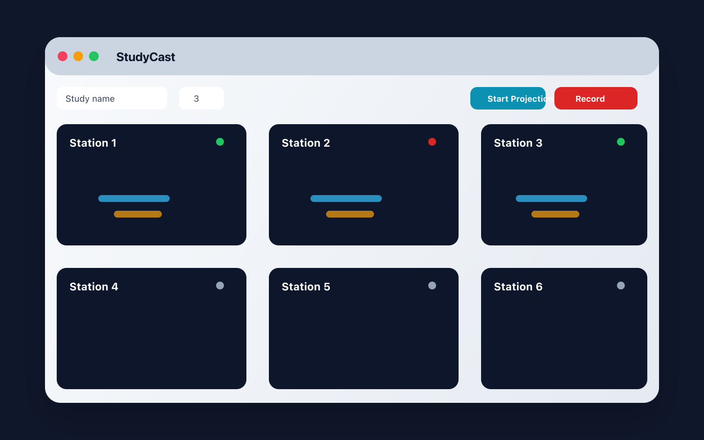

# StudyCast

StudyCast is a macOS multi-device AirPlay capture desk for research sessions, teaching labs, and product demos.

It runs one AirPlay receiver per station, shows local previews, routes monitoring audio per station, and saves MP4 recordings for each connected device.



## Status

StudyCast is an early beta. It is useful for controlled local-network sessions, but it is not production broadcast software and does not try to replace commercial AirPlay receivers.

The first binary release targets Apple Silicon Macs on macOS 26 or newer. Older macOS versions may work from source, but they are not covered by the downloadable beta.

## Features

- Run 1 to 8 AirPlay receiver stations from one macOS app.
- Preview each device stream in a responsive SwiftUI grid.
- Start and stop recording intervals while projection continues.
- Save per-station master recordings and trimmed MP4 clips.
- Select a monitoring audio output per station.
- Bundle UxPlay, GStreamer, ffmpeg, and ffprobe for release builds.

## Try StudyCast

StudyCast currently offers two beta paths.

### Option 1: Build from source

This is the most transparent path for developers and security-sensitive users. See [docs/INSTALL.md](docs/INSTALL.md).

Quick path:

```sh
brew install gstreamer ffmpeg libplist openssl@3 libsodium
(cd third_party/UxPlay && cmake . && make -j"$(sysctl -n hw.ncpu)")
xcodebuild -project StudyCast.xcodeproj -scheme StudyCast -configuration Debug -destination 'platform=macOS' CODE_SIGNING_ALLOWED=NO build
```

### Option 2: Unsigned preview DMG

For users who want the easiest install path today, GitHub Releases may include `StudyCast-0.1.0-beta.2-arm64-unsigned.dmg`.

This preview DMG is ad-hoc signed but not Apple Developer ID signed or notarized. StudyCast does not yet have a paid Apple Developer Program account, so macOS Gatekeeper will ask you to approve it manually in **System Settings > Privacy & Security** after the first launch attempt.

1. Download `StudyCast-0.1.0-beta.2-arm64-unsigned.dmg`.
2. Open the DMG and drag StudyCast into Applications.
3. Launch StudyCast once. If macOS blocks it, open **System Settings > Privacy & Security** and choose **Open Anyway**.
4. Relaunch StudyCast and allow Local Network access.
5. Click **Start Projection**, then choose a `StudyCast-N` AirPlay target from each device and enter the four-digit pairing code shown beside that station's name.
6. Click **Start Recording** and **Stop Recording** to mark clips.
7. Click **Stop Projection** to finalize the MP4 files.

Stations are published over Apple peer-to-peer (AWDL) as well as the local
network, so senders can reach StudyCast without joining the same network and
without the network operator registering the Mac. See
[docs/AWDL_DISCOVERY.md](docs/AWDL_DISCOVERY.md).

## Release Builds

Unsigned preview DMGs are prepared locally with:

```sh
export RELEASE_VERSION=0.1.0-beta.2
(cd third_party/UxPlay && cmake . && make -j"$(sysctl -n hw.ncpu)")
scripts/package_unsigned_preview.sh
```

Future signed and notarized DMGs can be prepared with:

```sh
export RELEASE_VERSION=0.1.0-beta.2
export DEVELOPER_ID_APPLICATION='Developer ID Application: Your Name (TEAMID)'
export NOTARYTOOL_PROFILE=studycast-notary
(cd third_party/UxPlay && cmake . && make -j"$(sysctl -n hw.ncpu)")
SIGNING_MODE=developer-id scripts/package_release.sh
```

See [docs/RELEASE.md](docs/RELEASE.md) before publishing.

## Troubleshooting

See [docs/TROUBLESHOOTING.md](docs/TROUBLESHOOTING.md) for AirPlay discovery, helper, audio, recording, signing, and Gatekeeper issues.

## License

StudyCast is licensed under GPL-3.0-only. Release builds bundle UxPlay and other third-party runtime components; see [Resources/ThirdPartyNotices](Resources/ThirdPartyNotices) and the source-offer notes before distributing binaries.
